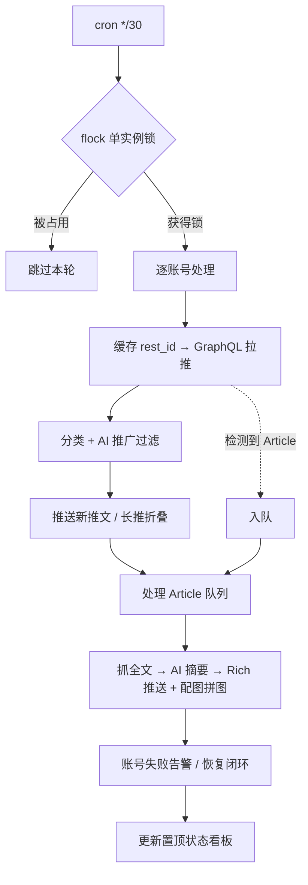

# x_monitor

X/Twitter 多账号监控 → Telegram 推送。定时拉取关注账号的新推文与长文，AI 过滤推广、生成中文摘要，以 Telegram 富文本（含配图拼图、可折叠正文、置顶状态看板）推送到一个私聊。

纯 Python 标准库实现，无第三方依赖，以 `*/30` cron 一次性进程运行（每轮约 6–16 秒）。

---

## 特性

**抓取**
- 多账号 **Twitter GraphQL**（免 API key）为主数据源；cookie 认证失效自动降级 guest 模式
- user `rest_id` 持久缓存，每轮 API 调用减半，账号失效（封禁/删除）自动失效缓存重解析
- 推送时间窗口防止积压回灌（数据源中断恢复后不补推过期推文）
- `flock` 单实例锁，避免上一轮未跑完与下一轮重叠

**推送与排版**
- 普通推文：HTML 格式，链接预览大图 +「打开原文」按钮
- 长推文：优先采用原文自带的 `TL;DR`，否则 AI 生成一句话摘要；全文折叠进可展开引用块（`blockquote expandable`）
- X Article 长文：抓取全文 → AI 中文摘要 → **`sendRichMessage`** 推送（单条上限 32768 字符，原生 Markdown）；文章配图自动拼成 `tg-collage`，论证细节折叠进 `details`；富文本被拒/超长自动回退旧的 HTML 分块路径，绝不丢消息

**AI**
- 推荐使用多模态模型
- 关键词初筛 + AI 复核的两级推广过滤，降低 AI 调用量

---

## 工作流程



---

## 目录结构

| 文件 | 说明 |
|---|---|
| `twitter_monitor.py` | 主程序：拉推、分类、推送、文章队列、告警、看板 |
| `twitter_graphql.py` | Twitter GraphQL 客户端（含 rest_id 缓存、guest 兜底） |
| `test_twitter_monitor.py` | 单元/回归测试（纯 mock，零网络） |
| `twitter_accounts.json` | 监控账号列表 `[{username, enabled}]` |
| `run.sh` | cron 入口 |
| `implementation-notes.md` | 实现决策/取舍记录 |

运行时生成的状态与密钥文件**不入库**（见 `.gitignore`）：

| 文件 | 内容 |
|---|---|
| `config.json` | Telegram bot token / chat id（沿用历史文件名） |
| `twitter_ai.json` | AI 后端配置与 API key |
| `.auth_cookies.json` | Twitter 登录 cookie（手工维护） |
| `twitter_seen/`、`twitter_articles/` | 已见推文 ID、文章队列与缓存 |
| `.user_id_cache.json`、`.account_failures.json`、`.dashboard.json` | rest_id 缓存、失败状态、看板状态 |

---

## 配置

**`config.json`** — Telegram 凭据：
```json
{ "telegram_bot_token": "<bot token>", "telegram_chat_id": "<chat id>" }
```

**`twitter_accounts.json`** — 监控账号：
```json
[
  { "username": "vista8", "enabled": true },
  { "username": "dontbesilent", "enabled": true }
]
```

**`twitter_ai.json`** — AI 后端与文章抓取命令：
```json
{
  "backends": [
    { "name": "mimo", "type": "openai", "api_base": "<url>", "api_key": "<key>", "model": "<model>", "timeout": 30 },
    { "name": "gemini", "type": "gemini", "api_base": "<url>", "api_key": "<key>", "model": "<model>", "timeout": 15 }
  ],
  "article_markdown_cmd": "/usr/local/bin/x-article-to-markdown"
}
```

文章全文抓取依赖外部命令 `article_markdown_cmd`（一个把 X 推文/文章 URL 转 Markdown 的脚本）。Twitter cookie 写入 `.auth_cookies.json`，失效时自动降级 guest 模式。

---

## 运行

cron（每 30 分钟）：
```cron
*/30 * * * * /root/x_monitor/run.sh >> /var/log/x_monitor.log 2>&1
```

手动调用：
```bash
python3 twitter_monitor.py              # 正常一轮
python3 twitter_monitor.py --seed       # 首次：只记录已见 ID，不推送
python3 twitter_monitor.py --dry-run    # 只打印，不推送
python3 twitter_monitor.py --test       # 推送过滤后最新 N 条（自检）
python3 twitter_monitor.py --user vista8  # 只处理指定账号
```

| 参数 | 默认 | 说明 |
|---|---|---|
| `--limit` | 20 | 每账号拉取条数 |
| `--max-push-age-minutes` | 45 | 超过此时长的推文不推（防积压回灌） |
| `--seed` / `--dry-run` / `--test` | — | 见上 |
| `--user` | — | 只处理某账号 |
| `--chat-id` / `--bot-token` | 配置文件 | 临时覆盖 |

测试：
```bash
python3 test_twitter_monitor.py    # 纯 mock，零网络
```

---

## 版本历史

| 版本 | 内容 |
|---|---|
| `v1.0` | 稳定基线：健壮性、Telegram 格式修复、死代码清理 |
| `v1.1` | 调度优化：失败告警、rest_id 缓存、转推 Article 抓取修复、队列清理 |
| `v1.2` | 文章摘要迁移 `sendRichMessage`（单条 32k 原生 Markdown） |
| `v1.3` | 文章配图拼图、长推 TL;DR/`details` 折叠、告警与失败通知闭环 |
| `v1.4` | 置顶状态看板 |
| `v1.4.1` | 看板当日计数以北京时间 06:00 为界 |
| `v1.5` | 看板自适应规避聊天 auto-delete |
| `v1.5.1` | 添加项目 README |
| `v1.5.2` | 新增监控账号 @karpathy |
| `v1.5.3` | 新增监控账号 @MacroMargin |
| `v1.6.0` | 普通推文升级 `sendRichMessage`（`send_tweet` rich-first + 长推 `details` 折叠）；配置文件改名 `config.json`；移除空号账号 |

回滚：`git checkout v1.3` 查看，`git diff v1.2 v1.3` 看变更，[tags 页](https://github.com/congee949/x_monitor/tags)可下载任意版本。

---

## 技术说明

- **运行模型**：无守护进程，每轮独立 cron 进程，跑完即退；跨轮状态全部落盘为 JSON。
- **依赖**：Python 3.9+，纯标准库（`urllib`/`json`/`subprocess`/`fcntl` 等），无 `pip` 依赖。
- **数据源**：Twitter GraphQL 为主；早期的付费 6551.io 兜底已弃用（相关代码保留为 inert）。
- **安全**：所有密钥与登录态文件均被 `.gitignore` 排除，git 历史经扫描确认不含任何密钥。
